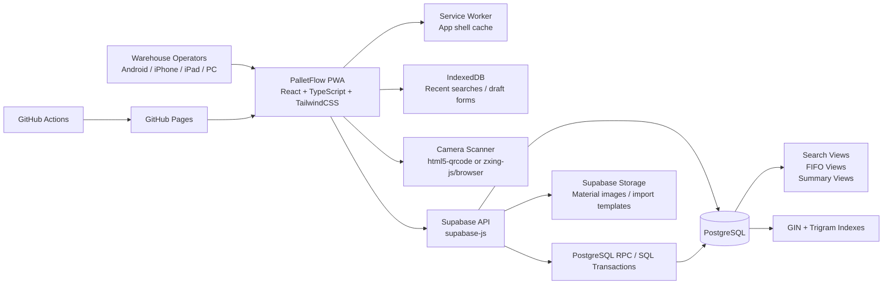

# PalletFlow System Architecture

## Target

Build a production-ready, mobile-first PWA for warehouse operators to manage:

- pallet placement
- material lookup
- FIFO picking
- batch-level stock
- cycle counting
- operation traceability

## Architecture Diagram

## Runtime Responsibilities

### Frontend PWA

- Home screen optimized for one-hand operation
- Material search and pallet search placed in the most prominent visual area
- Camera-based barcode scan in every search entry
- Fast confirmation flows for inbound and outbound
- Installable app shell for repeat use on warehouse devices
- Browser local storage is non-authoritative and only used for cache and temporary drafts

### Supabase / PostgreSQL

- Single source of truth for batch inventory
- Transaction-safe stock mutations
- FIFO suggestions based on `production_date`, then `created_at`
- Full operation history for inbound, outbound, cycle count, and clear pallet
- High-speed fuzzy search using `pg_trgm`
- Material master data and barcode aliases support controlled Excel import

### Storage

- Optional material images
- Excel templates for import/export workflows

## Key Design Decisions

1. Current stock is tracked at batch level, not in a simple summary stock table.
2. Every inventory mutation must create immutable operation lines.
3. Outbound, clear pallet, and cycle count adjustments should execute through database transactions or RPC functions, not piecemeal client updates.
4. Search speed is protected through indexed searchable text and barcode lookup.
5. Browser reset must not destroy official business data because the source of truth lives in Supabase, not in local browser storage.
6. Multi-warehouse, OCR, AI voice, and permissions are not enabled in V1, but the schema reserves extension points.

## Recommended Backend Execution Model

The frontend should avoid directly stitching together multi-step inventory writes. Instead, implement transactional RPC functions during coding:

- `search_materials(query_text, limit_count)`
- `get_fifo_suggestions(material_id, requested_qty)`
- `create_inbound_batch(payload)`
- `confirm_outbound_pick(payload)`
- `start_cycle_count(payload)`
- `complete_cycle_count(payload)`
- `clear_pallet(payload)`

This keeps stock consistency on the database side and reduces race-condition risk in production.

## Non-Functional Guardrails

- Mobile-first layout before desktop enhancement
- No hard-coded pallet count
- No hard-coded material count
- No mock inventory data
- Search response target under 1 second for 5000+ materials
- All delete-like actions are history-preserving, not destructive
