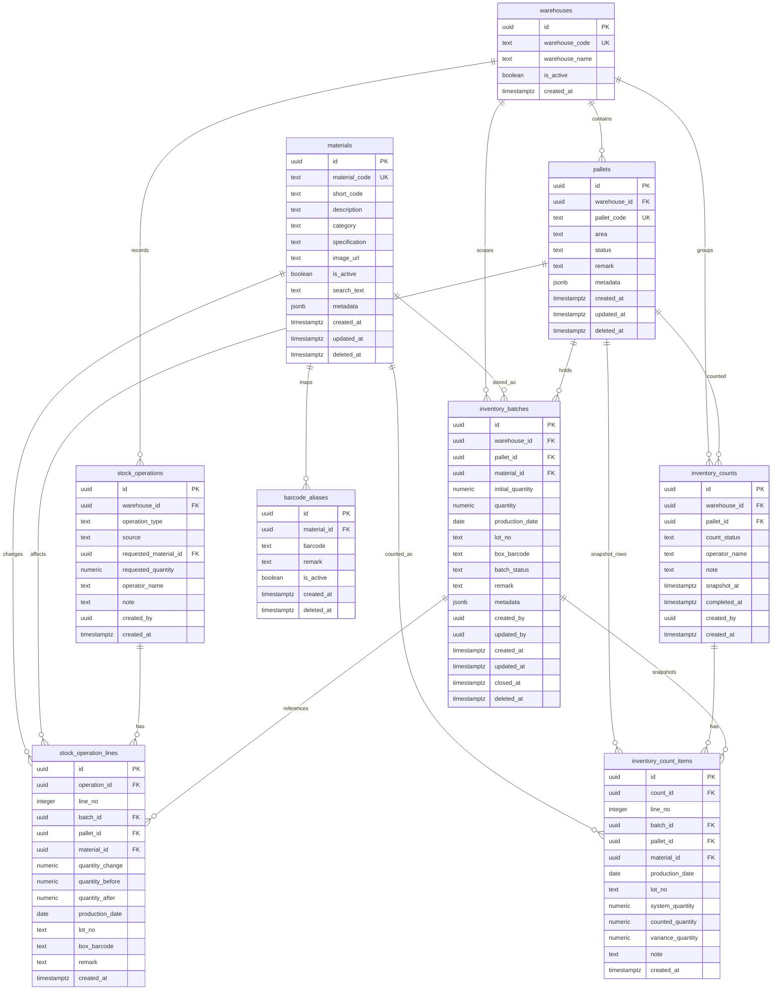

# PalletFlow Database ER Design

## ER Diagram

## Design Notes

### Core Inventory Rule

`inventory_batches` is the source of truth for available stock. Rows stay in history even when `quantity = 0`.

### FIFO Rule

Outbound suggestions sort by:

1. `production_date` ascending
2. `created_at` ascending
3. `id` ascending as the final stable tie-breaker

### Production Month Storage

The PRD uses year-month granularity. The database stores it as a `date` pinned to the first day of the month.

Examples:

- `2024-12-01`
- `2025-03-01`

The UI always renders it as `YYYY-MM`.

### Why Logs Are Split Into Header + Lines

One outbound request can consume multiple pallets and multiple batches. A header-line model avoids losing traceability when one action spans many rows.

### V2 Reserved Fields

The schema already reserves expansion points for:

- `warehouse_id`
- `created_by`
- `updated_by`
- `metadata`

That allows later growth into multi-warehouse, OCR enrichment, AI parsing hints, and role-based access without redesigning the main inventory tables.
