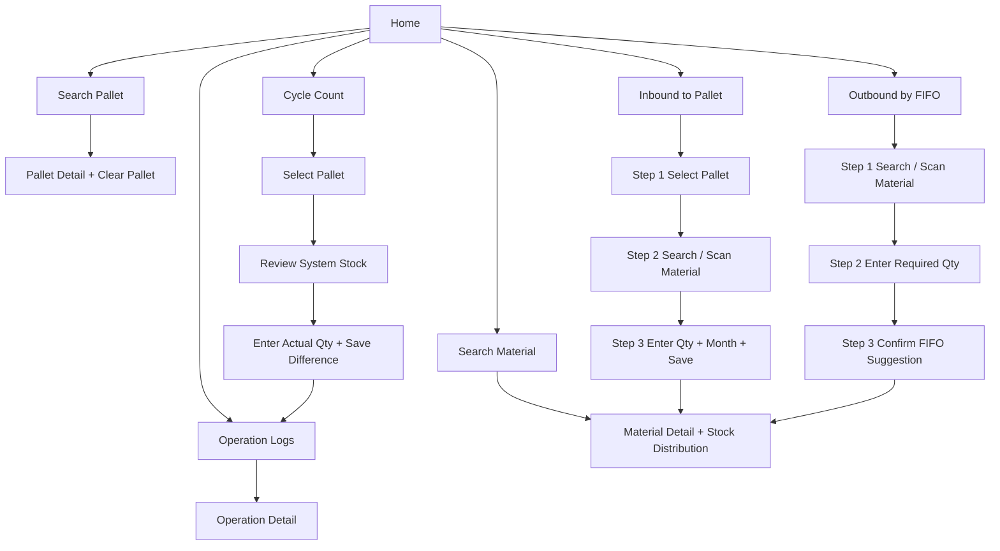
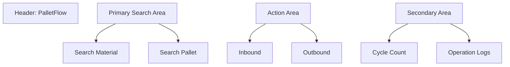

# PalletFlow Page Flow

## Navigation Principle

The application should feel like a field tool, not a management backend.

- Search material and search pallet must be visually strongest on the home screen.
- Inbound and outbound must finish within three steps.
- Count and logs remain accessible, but should not overshadow the two primary lookup tasks.

## Global Navigation Flow

## Home Screen Information Hierarchy

## Inbound Flow Rules

1. Step 1: choose pallet from recent list or search by code.
2. Step 2: search material by code, short code, description, or barcode scan.
3. Step 3: enter quantity, production month, optional lot, optional box barcode, then save.

## Outbound Flow Rules

1. Step 1: search material by text or barcode.
2. Step 2: input required quantity.
3. Step 3: system returns FIFO suggestions grouped by pallet and batch; user confirms once.

## Search Material Screen Rules

- Search box is fixed at the top
- Scan button is always visible
- Result card must show exact code, short code, description
- Stock distribution list sorts by production month ascending
- Summary block shows total stock, pallet count, earliest month, latest month

## Search Pallet Screen Rules

- Enter pallet code directly from keypad
- Show only active stock rows by default
- Support in-list keyword filter for material
- Clear pallet action stays at the bottom and requires double confirmation

## Cycle Count Rules

- Count is always started from pallet level in V1
- System stock is loaded before editing
- Difference rows must be visible before save
- Saving a count must also create traceable stock operation lines when adjustments are applied
